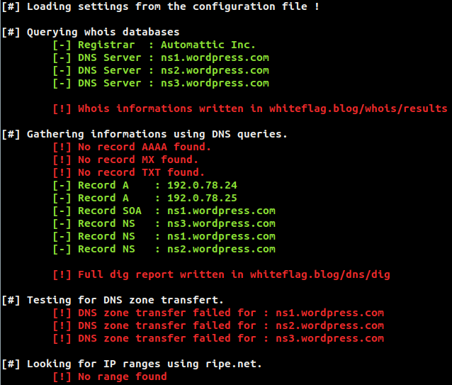
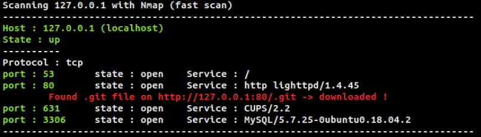
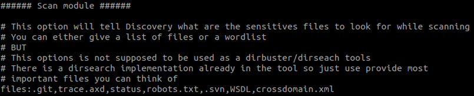
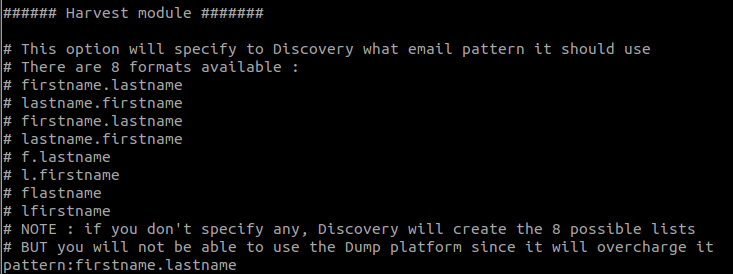

# Discovery
Author Aurélien Chalot
Version 2.0

Discovery is a fully automated OSINT tool that will gather informations from a lot of differents sources and cross the results in order to fingerprint as best as possible a domain name.

## Warning

This tool relies on 4 FREE API's : 
- Shodan : https://www.shodan.io/
- WhatCMS : https://whatcms.org/API
- Hunter.io : https://hunter.io/
- RocketReach : https://rocketreach.co/api 

You can chose whether or not you want to use them. If you don't provide  the API keys then the hunter, shodan, rocketreach and whatcms API won't be used.

The tool configuration can be set in the configuration file :

## Whois/DNS request

How to use :

    python3 discovery.py -d domain.tld --dns

This module actually does a lot of things :
- Query Whois databases to gather the name of the registrant, who's responsible of it and some DNS servers name
- Query Google DNS to retrieve records
- Try to perform DNS transfert zone on the previously found DNS servers
- Gather IPv4 ranges beloging to the domain.tld

From this IP range Discovery will list all existant IP's :

## DNS enumeration

The second module is the implementaiton of the sublist3r python3 module written by aboulela :
https://github.com/aboul3la/Sublist3r
You can call it using two differents options :

    python3 discovery.py -d domain.tld --sublist
or

    python3 discovery.py -d domain.tld --subrute

The difference is that when using --subrute, sublist3r will perform a DNS bruteforce which will take much more time but will also find more subdomains.

In the configuration file you wan choose whether or not the www.domain.tld and domain.tld should be merged. You must be aware that almost all the time, www.domain.tld is the same thing as 
domain.tld. But sometimes it is not which means we might loose some Virtual Hosts by merging www.domain.tld and domain.tld 

This configuration can be done in the configuration file :

## Scanner module

This module is composed of two functions and can be called that way :

    python3 discovery.py -d domain.tld --scan ["full" or "fast"]

The first function is an implementaiton of the python nmap librairy. It will scan the discovered IP's either the "full" way (which means it will check for the all 65535 ports) or the "fast" way (-F nmap option).

Depending of the services discovered it will perform a few actions :
- Check SSL certificate
- Check for the CMS used (if there is one)
- Check for comon important files (.git, /status, trace.axd, robots.txt. If those files are found, they will be downloaded).
- Look for WAF using Wafw00f (https://github.com/EnableSecurity/wafw00f)
- Look For reverse proxy using HTTP-Traceroute.py made by Nicolas Gregoire and Julien Cayssol

You can add as much files as you want in the configuration file :

The tool will output an XML files that you will be able to add in the NMAP plugin (rapport type)

The second function will use the Shodan API to gather informations about the domain name : found servers, services, CVE's related to the services and a quick decription

## Metadatas Scrapper

This module is basically my python version of FOCA :

    python3 discovery.py -d domain.tld --gather

Using Google dorks it will gather publicly exposed documents and parse their metadatas in order to find sensitive informations (credentials for exemple)
This module is inspired by the pyfoca script written by altjx : https://github.com/altjx/ipwn/tree/master/pyfoca

To parse the metadatas I used exiftool.

You can add as much extensions as you want in the configuration file :

Note that in order to be parsed, the gathered documents must be downloaded. Sometimes it might take a lot of space.
If you don't want to keep the downloaded files you can set the option in the configuration so that they will be deleted once parsed :

This module will also check for sensitive files on Pastebin and Github. For each document found,it will check for the words filled in the configuration file :

## Harvestor

The last module will use differents API's to gather names of employee working for the given domain name. 
Especially the RocketReach API using some parts of @Simon PeopleScrap tool :
https://github.com/n3tsky/PeopleScrap

It will then create a few lists of emails :

    python3 discovery.py -d domain.tld --harvest 

You can set the pattern to use for the mail creation in the configuration file :

If you specify a non handled pattern or don't specify any then Discovery will create all possible lists using all handled patterns :

# Full command 

So basically if you want to run all modules you can use this command :

    python3 discovery.py -d domain.tld --dns (--sublist or --subrute) --scan (full or fast) --gather --harvest
    
All results will be written in a file in this tree :

# To Do list :

 - Code refactoring
    - Use of class
    - each functions/modules in separate files
    - Review of the already existing code (adding some performance)

 - Document gathering :
    - Search for sensitive files on Pastebin/Github (DONE FOR PASTEBIN)
    - Archive.org : error messages
    - Google dorks (index of, error message)
    
 - Scanning function
    - May be add some web scanner or API that detects flaws related to a certain CMS https://github.com/Tuhinshubhra/CMSeeK
    - Add Http screenshot
    - Searchsploit and parse output of searchsploit results
    - Add UDP scans
    - Dirbuster ? http/s vhost/ipt 
    - If SVN or .git -> dvcs ripper ???
 
 - DNS enumeration 
    - check for reverse dns (PTR ?)
    - Check CN's in protocoles' certificates (ssh, ftps....)
    - Add FDNS databases lookup
    
 - Configuration file :
    - Add a real configuration file (give possibility to remove github repos, pastes, downloaded files (if there are no warning words in them) merging all existing files
 
 - Final :
    - Search on the deep web
    - Threads files downloads and modules so that they can work in parrallel
    - Get ride of the API's (especially the whatcms api and the hunter/rocketreach)
    - Add the possibility to use some modules with a list of domains (at least --sublist/--subrute and --harvest)

